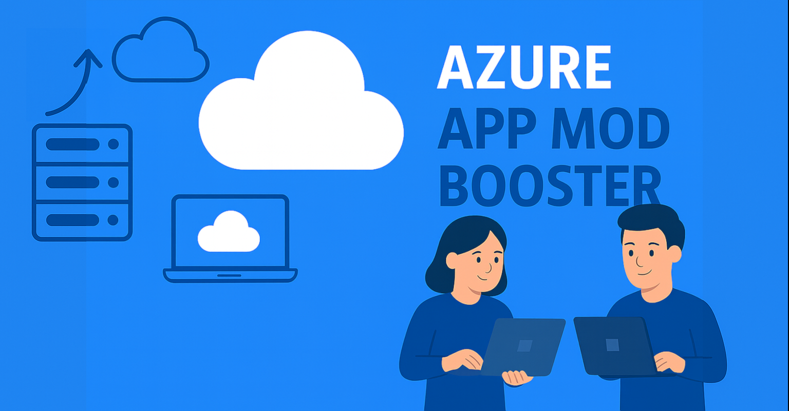

# Modern Expense Management System

A cloud-native expense management application that modernizes legacy expense tracking systems using Azure services, ASP.NET Core 8, and AI-powered features.



## 🎯 Overview

This application demonstrates modern cloud application development best practices:

- **Passwordless Authentication**: Uses Azure Managed Identity for all service connections
- **Secure Database Access**: Azure AD-only authentication with stored procedures
- **AI-Powered Chat**: Azure OpenAI GPT-4o with function calling for natural language database operations
- **Modern UI**: Clean, responsive interface built with ASP.NET Core Razor Pages
- **API-First Design**: RESTful APIs with Swagger/OpenAPI documentation
- **Infrastructure as Code**: Complete Bicep templates for Azure deployment

## 📸 Legacy Application Modernized

This project modernizes a legacy expense management system with three main screens:

1. **Add Expense** - Submit expense claims with category, amount, date, and description
2. **View Expenses** - List and filter expenses by status with search functionality
3. **Approve Expenses** - Manager view to approve/reject pending expenses

See `Legacy-Screenshots/` for original application screens.

## 🏗️ Architecture

```
┌─────────────────────────────────────────────────────────┐
│  Users → App Service (Razor Pages + APIs)              │
│           ↓                    ↓                         │
│    Azure SQL Database    Azure OpenAI (GPT-4o)          │
│           ↑                                              │
│    Managed Identity (Passwordless Auth)                 │
└─────────────────────────────────────────────────────────┘
```

See [ARCHITECTURE.md](ARCHITECTURE.md) for detailed architecture diagram.

## 🚀 Quick Start

### Prerequisites

- Azure subscription
- Azure CLI installed and authenticated (`az login`)
- Python 3.8+ with pip
- .NET 8 SDK
- ODBC Driver 18 for SQL Server

### Option 1: Basic Deployment (No AI Features)

```bash
chmod +x deploy.sh
./deploy.sh
```

This deploys:
- ✅ Azure App Service
- ✅ Azure SQL Database
- ✅ User-Assigned Managed Identity
- ✅ Complete expense management application

### Option 2: Full Deployment (With AI Chat)

```bash
chmod +x deploy-with-chat.sh
./deploy-with-chat.sh
```

This deploys everything in Option 1 PLUS:
- ✅ Azure OpenAI (GPT-4o model)
- ✅ Azure AI Search
- ✅ AI-powered chat assistant

## 🎯 Features

### Core Functionality

- ✅ **Create Expenses**: Add expense claims with amount, category, date, description
- ✅ **View Expenses**: List all expenses with filtering by status
- ✅ **Submit for Approval**: Change expense status from draft to submitted
- ✅ **Approve/Reject**: Manager workflow to approve or reject expenses
- ✅ **Update/Delete**: Modify or remove draft expenses
- ✅ **Expense Summary**: View statistics by status

### Technical Features

- ✅ **RESTful APIs**: 17 endpoints with Swagger documentation
- ✅ **Stored Procedures**: All database access via 15 stored procedures
- ✅ **Managed Identity**: Passwordless authentication to SQL and OpenAI
- ✅ **Error Handling**: Detailed error messages with dummy data fallback
- ✅ **Responsive UI**: Modern, mobile-friendly interface
- ✅ **AI Chat**: Natural language interface to database operations

### AI Chat Capabilities

Ask the AI assistant to:
- "Show me all pending expenses"
- "List expenses over £100"
- "Get expense summary"
- "Show me expenses submitted today"

The AI uses function calling to execute real database operations and returns formatted results.

## 📁 Project Structure

```
.
├── infra/                          # Infrastructure as Code
│   ├── main.bicep                  # Main deployment template
│   └── modules/
│       ├── app-service.bicep       # App Service + Plan
│       ├── azure-sql.bicep         # SQL Server + Database
│       ├── managed-identity.bicep  # User-Assigned Managed Identity
│       └── genai.bicep             # Azure OpenAI + AI Search
│
├── src/ExpenseManagement/          # .NET 8 Application
│   ├── Controllers/                # API Controllers
│   │   ├── ExpensesController.cs   # Expense CRUD + workflows
│   │   ├── CategoriesController.cs # Category lookup
│   │   ├── UsersController.cs      # User information
│   │   └── ChatController.cs       # AI chat endpoint
│   ├── Services/
│   │   ├── DatabaseService.cs      # Database access layer
│   │   └── ChatService.cs          # Azure OpenAI integration
│   ├── Models/                     # Data models and DTOs
│   ├── Pages/                      # Razor Pages
│   │   ├── Expenses/Index.cshtml   # List expenses
│   │   ├── Expenses/AddExpense.cshtml
│   │   ├── Expenses/ApproveExpenses.cshtml
│   │   └── Chat.cshtml             # AI chat interface
│   └── wwwroot/css/                # Custom CSS
│
├── Database-Schema/
│   └── database_schema.sql         # SQL Server schema + seed data
│
├── stored-procedures.sql           # 15 stored procedures
├── script.sql                      # Managed identity DB roles
│
├── run-sql.py                      # Import database schema
├── run-sql-dbrole.py               # Configure DB roles
├── run-sql-stored-procs.py         # Deploy stored procedures
│
├── deploy.sh                       # Basic deployment script
├── deploy-with-chat.sh             # Full deployment with AI
│
└── ARCHITECTURE.md                 # Architecture diagram
```

## 📊 API Endpoints

### Expenses API

```
GET    /api/expenses              - List all expenses
GET    /api/expenses/{id}         - Get expense by ID
POST   /api/expenses              - Create new expense
PUT    /api/expenses/{id}         - Update expense (draft only)
DELETE /api/expenses/{id}         - Delete expense (draft only)
POST   /api/expenses/{id}/submit  - Submit for approval
POST   /api/expenses/{id}/approve - Approve expense
POST   /api/expenses/{id}/reject  - Reject expense
GET    /api/expenses/status/{status} - Filter by status
GET    /api/expenses/pending      - Get pending expenses
GET    /api/expenses/summary      - Get summary statistics
```

### Other APIs

```
GET    /api/categories            - List expense categories
GET    /api/users                 - List all users
POST   /api/chat                  - Chat with AI assistant
```

Full API documentation available at `/swagger` when running.

## 🔐 Security Features

- **Azure AD-Only Authentication**: SQL Server configured with Azure AD authentication only
- **Managed Identity**: Passwordless connections to all Azure services
- **No Secrets**: No passwords, connection strings, or API keys in code
- **HTTPS Only**: TLS 1.2+ enforced
- **Least Privilege**: Managed identity has minimal required permissions
- **Input Validation**: All API inputs validated
- **SQL Injection Protection**: Stored procedures with parameterized queries

## 🛠️ Local Development

To run the application locally:

1. **Configure connection string** in `appsettings.json`:
   ```json
   {
     "ConnectionStrings": {
       "DefaultConnection": "Server=tcp:your-server.database.windows.net;Database=Northwind;Authentication=Active Directory Default;"
     }
   }
   ```

2. **Authenticate with Azure**:
   ```bash
   az login
   ```

3. **Run the application**:
   ```bash
   cd src/ExpenseManagement
   dotnet run
   ```

4. **Access the application**:
   - UI: https://localhost:5001/Expenses
   - API: https://localhost:5001/api
   - Swagger: https://localhost:5001/swagger

Note: Use `Authentication=Active Directory Default` for local development instead of Managed Identity.

## 📝 Database Schema

The application uses a SQL Server database with the following tables:

- **Roles**: Employee, Manager
- **Users**: User accounts with role assignments
- **ExpenseCategories**: Travel, Meals, Supplies, Accommodation, Other
- **ExpenseStatus**: Draft, Submitted, Approved, Rejected
- **Expenses**: Expense records with amount (in pence), category, status

All amounts are stored as integers (minor currency units) to avoid floating-point issues.

## 🔄 Deployment Process

The deployment scripts follow this order:

1. Create resource group
2. Deploy infrastructure (App Service, SQL, Managed Identity, optionally GenAI)
3. Configure App Service settings
4. Wait for SQL Server readiness (30 seconds)
5. Configure firewall rules
6. Import database schema
7. Configure managed identity database access
8. Deploy stored procedures
9. Build and publish .NET application
10. Create deployment package (app.zip)
11. Deploy to App Service

## 📚 Additional Resources

- [Azure Best Practices](https://learn.microsoft.com/en-us/azure/architecture/best-practices/index-best-practices)
- [ASP.NET Core Documentation](https://learn.microsoft.com/en-us/aspnet/core/)
- [Azure OpenAI Service](https://learn.microsoft.com/en-us/azure/ai-services/openai/)
- [Azure Managed Identity](https://learn.microsoft.com/en-us/azure/active-directory/managed-identities-azure-resources/overview)

## 🤝 Contributing

This is a demonstration project for modernizing legacy applications to Azure. Feel free to use it as a template for your own modernization projects.

## 📄 License

See [LICENSE](LICENSE) file for details.

## 🎉 Acknowledgments

Built following Azure best practices and modern cloud-native application patterns.

---

**Note**: After deployment, navigate to `{your-app-url}/Expenses` (not just the root URL) to access the application.
